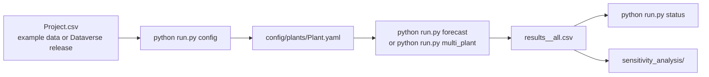

# NYSolarForecastLab

[](https://github.com/zhesun-0209/NYSolarForecastLab/actions/workflows/ci.yml)
[](https://doi.org/10.1016/j.tra.2026.105040)
[](https://doi.org/10.7910/DVN/3VKAGM)
[](LICENSE)

Reference implementation and benchmark utilities for:

**Toward better integration of solar energy in transportation systems: machine learning benchmarks for day-ahead photovoltaic power forecasting**

Zhaoyao Bao, Zhe Sun, Yishuo Jiang, Chi Xie, Lijun Sun, and H. Oliver Gao

*Transportation Research Part A: Policy and Practice*, 210, 105040, 2026
DOI: [10.1016/j.tra.2026.105040](https://doi.org/10.1016/j.tra.2026.105040)

This repository supports the paper's day-ahead photovoltaic (PV) forecasting benchmark for transportation energy-management and planning applications. It provides one command-line workflow for preparing plant configs, running model grids, resuming interrupted experiments, checking progress, and exporting comparable result CSVs.

## At A Glance

| Item | Details |
| --- | --- |
| Task | Day-ahead hourly PV capacity-factor forecasting |
| Models | Linear Regression, Random Forest, XGBoost, LightGBM, LSTM, GRU, Transformer, TCN |
| Inputs | PV, PV+HW, PV+NWP, PV+NWP+, NWP, NWP+ |
| Full grid | 284 configurations per plant |
| Included data | Three example benchmark-format plants: 171, 172, 186 |
| Full data release | [Harvard Dataverse DOI: 10.7910/DVN/3VKAGM](https://doi.org/10.7910/DVN/3VKAGM) |
| Main entry point | `python run.py ...` |

The committed CSV files are smoke-test fixtures with the same schema as the benchmark data. They let a first-time user verify the code without downloading the full dataset. The paper-scale 100-plant release should be downloaded from Dataverse for full reproduction.

## Workflow



## Start Here

Use Python 3.10 or newer.

```bash
git clone https://github.com/zhesun-0209/NYSolarForecastLab.git
cd NYSolarForecastLab
python -m pip install --upgrade pip
python -m pip install -r requirements.txt
```

Generate plant configuration files for every `data/Project*.csv` file:

```bash
python run.py config
```

Run the fastest smoke test on included Plant 171:

```bash
python run.py forecast --plant-id 171 --test-mode --test-model Linear --output-dir results/smoke
python run.py status --output-dir results/smoke
```

Expected smoke-test artifact:

```text
results/smoke/results_171_all.csv
```

The smoke CSV should contain two successful Linear Regression rows for the NWP and NWP+ input settings. On Apple Silicon or constrained machines, prefix commands with `FORCE_CPU=1` if PyTorch advertises MPS but a model run fails.

Optional visual check of the included example data:

```bash
python examples/plot_monthly_generation.py
```

This writes `figures/example_monthly_generation.png`.

## Full Benchmark Runs

Run the complete 284-configuration grid for one plant:

```bash
python run.py forecast --plant-id 171 --output-dir results/plant171
```

Run multiple configured plants:

```bash
python run.py multi_plant --plants 171 172 186 --output-dir results/sample_plants
python run.py status --output-dir results/sample_plants
```

To run the full Dataverse release, download the `Project<ID>.csv` files from [10.7910/DVN/3VKAGM](https://doi.org/10.7910/DVN/3VKAGM), place them under `data/`, regenerate configs, and run:

```bash
python run.py config
python run.py multi_plant --output-dir results/full_release
```

The experiment runner appends one row after each configuration, so interrupted runs can be resumed. Rows with `status=FAILED` are reported in the CSV and are not counted as completed by `status`.

## Result Files

Each plant writes one summary CSV:

```text
results_<plant_id>_all.csv
```

Important columns:

| Column | Meaning |
| --- | --- |
| `experiment_name` | Unique model/input/lookback/time-encoding configuration |
| `model`, `complexity` | Forecasting method and low/high setting |
| `feature_combo` or `scenario` | Input setting such as PV+NWP or NWP+ |
| `lookback_hours` | Historical window length |
| `use_time_encoding` | Whether cyclic calendar/hour features are used |
| `mae`, `rmse`, `r2`, `nrmse` | Test-set metrics on inverse-transformed capacity factor |
| `train_time_sec` | Wall-clock training time |
| `test_samples` | Number of evaluated hourly targets |
| `status`, `error` | Success/failure bookkeeping for resume and audit |

## Data And Usage Terms

The paper's data availability statement identifies this GitHub repository as the code release and Harvard Dataverse as the full data release:

- Code: [https://github.com/zhesun-0209/NYSolarForecastLab](https://github.com/zhesun-0209/NYSolarForecastLab)
- Full 100-plant dataset: [https://doi.org/10.7910/DVN/3VKAGM](https://doi.org/10.7910/DVN/3VKAGM)

The code is released under the MIT License. The data are provided for non-commercial research use and should be cited together with the paper. See [data/README.md](data/README.md) for schema details and [REPRODUCIBILITY.md](REPRODUCIBILITY.md) for a step-by-step reproduction path.

## Experiment Grid

Each full plant benchmark contains 280 non-Linear configurations plus 4 Linear Regression configurations:

| Component | Values |
| --- | --- |
| Deep learning models | LSTM, GRU, Transformer, TCN |
| Machine-learning models | Random Forest, XGBoost, LightGBM |
| Baseline | Linear Regression |
| Complexity | low, high |
| Lookback | 24 h, 72 h for PV-based inputs; 0 h for NWP-only inputs |
| Time encoding | enabled, disabled |
| Input sets | PV, PV+HW, PV+NWP, PV+NWP+, NWP, NWP+ |

## Sensitivity Analyses

```bash
python run.py sensitivity --analysis lookback_window
python run.py sensitivity --analysis model_complexity
python run.py sensitivity --analysis training_scale
python run.py sensitivity --analysis seasonal_effect
python run.py sensitivity --analysis hourly_effect
python run.py sensitivity --analysis weather_feature
```

## Repository Layout

```text
NYSolarForecastLab/
├── config/                  # Plant and experiment configuration
├── data/                    # Example plant CSVs and data documentation
├── docs/                    # Sphinx documentation
├── models/                  # Forecasting model implementations
├── sensitivity_analysis/    # Ablation and sensitivity-analysis scripts
├── tests/                   # Unit tests and interface smoke tests
├── train/                   # Training pipelines for DL and ML models
├── eval.py                  # Metrics and result export helpers
├── experiments.py           # Experiment grid and batch runners
└── run.py                   # Command-line entry point
```

## Citation

If you use this repository, please cite the paper:

```bibtex
@article{BAO2026105040,
  title = {Toward better integration of solar energy in transportation systems: machine learning benchmarks for day-ahead photovoltaic power forecasting},
  journal = {Transportation Research Part A: Policy and Practice},
  volume = {210},
  pages = {105040},
  year = {2026},
  issn = {0965-8564},
  doi = {10.1016/j.tra.2026.105040},
  url = {https://www.sciencedirect.com/science/article/pii/S0965856426001813},
  author = {Zhaoyao Bao and Zhe Sun and Yishuo Jiang and Chi Xie and Lijun Sun and H. {Oliver Gao}},
  keywords = {Transportation, Solar power, Forecasting, Photovoltaic, Machine learning, Benchmark}
}
```

## License

This project's code is released under the MIT License. See [LICENSE](LICENSE).
